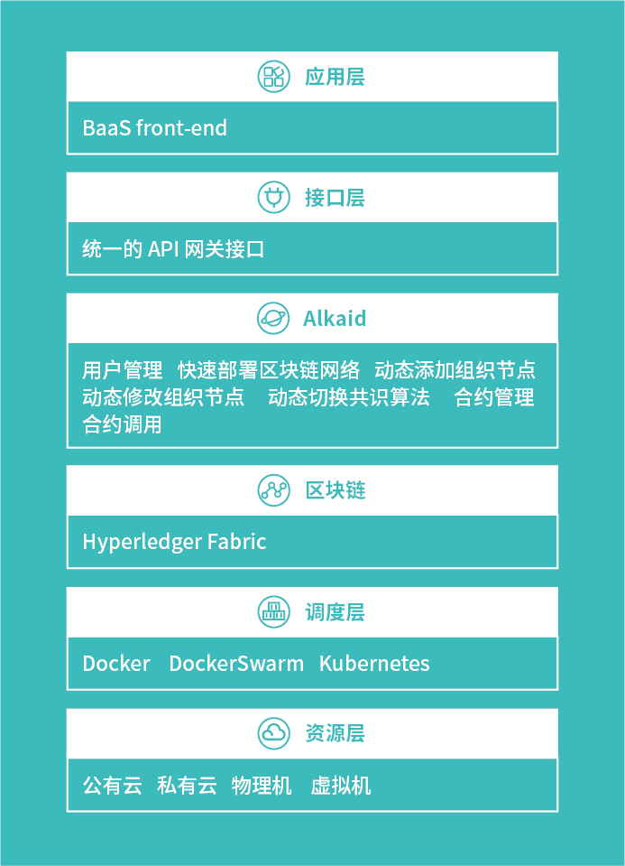

# Alkaid

Alikid 是一个基于 Hyperledger Fabric 实现的 BaaS(Blockchan as a Service) 服务

目前还在设计阶段, 计划支持 docker, docker swarm, kubernetes

Alikid 的前身是 [hlf-deploy](https://github.com/yakumioto/alkaid/tree/v0.2.0) 用于快速实现对 Hyperledger Fabric 网络的部署与调整

## 架构图

## hlf-deploy

支持的功能:

- channel create
- channel updateAnchorPeer
- channel join
- channel update (支持 BatchTimeout, BatchSize)
- chaincode install
- chaincode instantiate
- chaincode upgrade
- chaincode invoke
- chaincode query
- organization join (动态添加组织, 支持 system channel)
- organization delete (动态删除组织, 支持 system channel)
- organization update (动态更新组织, 支持 system channel)
- channel consensus (切换 orderer 共识, 支持 solo, kafka, etcdraft)